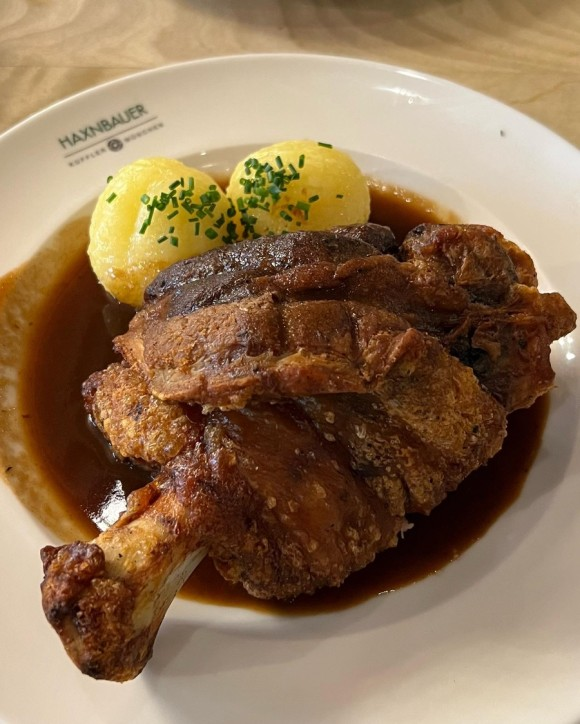
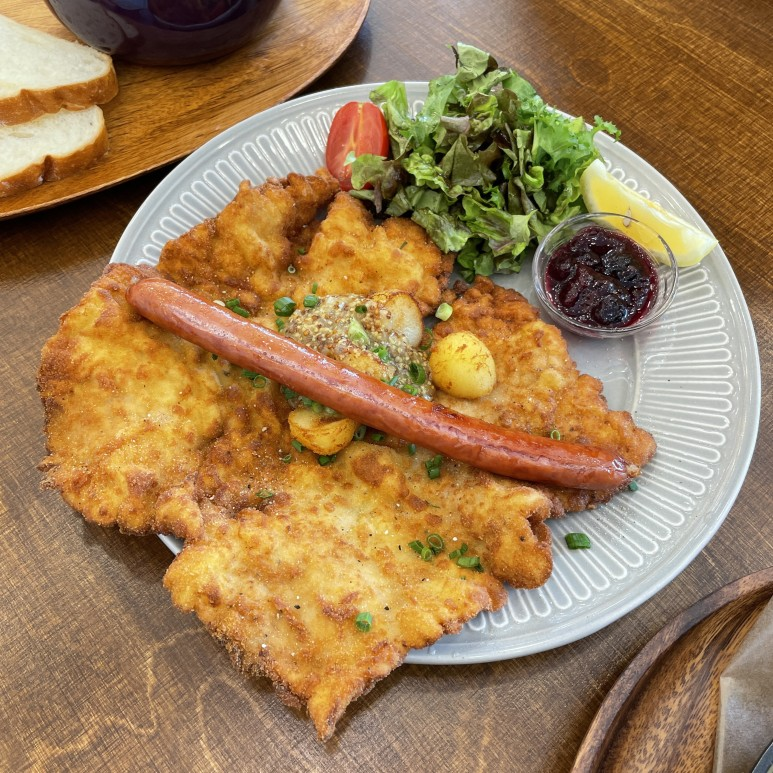

# Germany <-> Czech Republic
## [Germany](https://search.naver.com/search.naver?sm=tab_hty.top&where=nexearch&query=%EB%8F%85%EC%9D%BC+%EA%B5%AD%EA%B0%80%EC%A0%95%EB%B3%B4&oquery=%EB%8F%85%EC%9D%BC+%EA%B5%AD%EA%B0%80%EC%A0%95%EB%B3%B4&tqi=is%2FnQwprvmZssFW5dvGssssstKR-130252)

### food
독일의 대표적인 음식 2가지를 소개하겠습니다
#### 1. 슈바인학센
  
#### 2. 당케슈니첼
  

## [Czech Republic](https://search.naver.com/search.naver?sm=tab_hty.top&where=nexearch&query=%EC%B2%B4%EC%BD%94+%EA%B5%AD%EA%B0%80%EC%A0%95%EB%B3%B4&oquery=%EC%B2%B4%EC%BD%94+%EA%B5%AD%EA%B0%80%EC%A0%95%EB%B3%B4&tqi=is%2FnhsprvTVssR8%2BcNossssssFG-454314)
